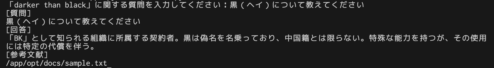
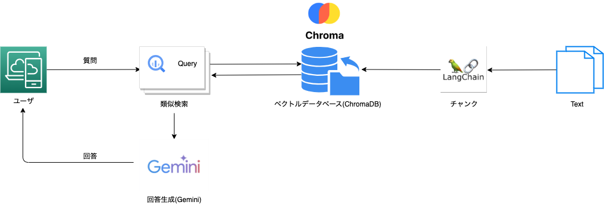

# LangChainとChromaDBによるQ&Aツール：検索拡張生成（RAG）でGemini APIを活用

<p align="center">
  
</p>


[](https://www.python.org/)
[](https://github.com/langchain-ai/langchain)
[](https://github.com/chroma-core/chroma)
[](https://docs.docker.com/compose/)


# 概要
本プロジェクトは、検索拡張生成（RAG）を用いたQandAツールです。ユーザーの質問をベクトルデータベースに類似検索をかけて最適な回答を探し出し、その情報を基にGemini APIに問い合わせて回答を生成します。

# 主なコンポーネント
1. LangChain フレームワーク
本ツールの中核となるフレームワークであり、検索拡張生成（RAG）モデルの構築と運用をサポートします。

2. ベクトルデータベース「chromadb」
質問の類似検索を行うためのベクトルデータベースです。ユーザーの質問をベクトル化し、過去の質問やドキュメントとの類似性を評価して最適な情報を提供します。

3. Gemini API
類似検索結果に基づいて最終的な回答を生成するためのAPIです。検索された情報をもとに、正確で詳細な回答を提供します。

# 起動方法

1. Google AI StudioからAPI Keyを取得しconfigファイルに記述
    1. Gemini APIページを開く
    2. 左側のメニューから「その他」 > API を選択します。
    3. APIキーを作成 ボタンをクリックします。
    4. 利用規約 に同意して 作成 ボタンをクリックします。
    5. APIキーをコピーします。
    6. apserver/opt/.envを作成し、GOOGLE_API_KEY="APIキー"、GEMINI_MODEL="gemini-pro"を記載します。
2. docker composeを起動
    ```
    docker compose up
    ```
3. ドキュメントをベクトルに変換しデータベースに保存
    ```
    docker compose exec api python opt/save.py
    ```
4. 質問をする
    ```
    docker compose exec api python opt/main.py
    ```

# 質問の投げ方
起動後、コマンドラインまたはWebインターフェースから質問を投げかけることができます。以下はコマンドラインからの例です。

```
「darker than black」に関する質問を入力してください：
```

# 仕組み

<p align="center">
  
</p>

1. **質問を受け取る**

    ユーザーからの質問をテキスト入力として受け取ります。

2. **ベクトル化と類似検索**

    入力された質問をベクトルデータに変換し、chromadbを使用して類似質問を検索します。

3. **Gemini APIへの問い合わせ**

    類似検索の結果をもとにGemini APIに問い合わせを行い、最適な回答を生成します。

4. **回答の提供**

    最終的な回答をユーザーに提供します。

# ディレクトリ構造
```
├── README.md
├── apserver
│   ├── Dockerfile
│   ├── opt
│   │   ├── __init__.py
│   │   ├── docs
│   │   │   └── sample.txt
│   │   ├── load.py
│   │   ├── main.py
│   │   ├── save.py
│   │   └── utils
│   │       ├── __init__.py
│   │       └── main.py
│   └── requirements.txt
├── compose.yaml
```

このディレクトリ構成は、apserverという名前のアプリケーションとその関連ファイルが含まれています。

詳細な説明は以下の通りです:

1. README.md
このファイルは、このディレクトリ構成とアプリケーションに関する情報を記載したMarkdownファイルです。

2. apserver ディレクトリ
このディレクトリには、アプリケーション本体とその関連ファイルが含まれています。
    1. Dockerfile
    このファイルは、Dockerイメージを作成するための設定ファイルです。

    2. opt ディレクトリ
    このディレクトリには、アプリケーションのメインモジュールとユーティリティモジュールが含まれています。

    3. sample.txt
    このファイルは、ドキュメントのサンプルコードが含まれています。

    4. load.py
    データベースからデータを出力し、類似検索をします。

    5. main.py
    このファイルは、アプリケーションのメインモジュールです。

    6. save.py
    このファイルは、sample.txtをベクトル変換しデータベースに保存します。

    7. utils ディレクトリ
    このディレクトリには、アプリケーションで使用されるユーティリティモジュールが含まれています。

3. compose.yaml
このファイルは、Docker Composeを使ってアプリケーションをデプロイするための設定ファイルです。


